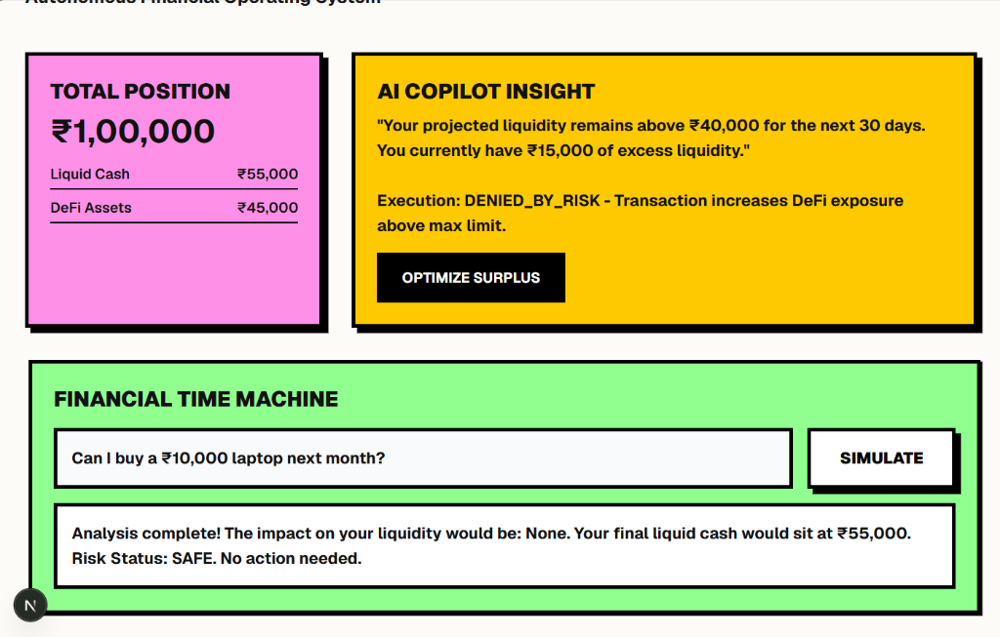

# FlowBank: Autonomous Financial Operating System



FlowBank is an autonomous, AI-driven financial operating system that allows users to manage their liquidity and interact with decentralized finance (DeFi) protocols through natural language intent. 

The system leverages a large language model (LLM) to parse user goals (e.g., "Supply 15,000 USDC to Aave"), checks these intents against personalized Risk and Policy engines, and formulates blockchain transactions to be executed securely via an on-chain smart account. It also includes a "Financial Time Machine" to simulate the impact of purchases or life events on future liquidity.

## 🚀 Features

- **Natural Language Intent Parsing**: Talk to your bank. Use the AI Copilot to execute complex financial operations.
- **Financial Time Machine**: Simulate "what if" scenarios (e.g., "Can I buy a ₹10,000 laptop next month?") to see immediate impacts on liquidity and risk status.
- **Risk & Policy Engine**: Every AI intent is rigorously validated against user-defined limits (e.g., maximum DeFi exposure, minimum liquidity) before execution.
- **Smart Account Abstraction**: Seamless on-chain execution with web3 integration (Wagmi + Hardhat) on the Sepolia Testnet.
- **Neo-Brutalism UI**: A bold, high-contrast user interface tailored for a premium, futuristic banking experience.

## 🏗 System Architecture

FlowBank consists of three main pillars:

1. **Frontend (Next.js + Tailwind CSS + Wagmi)**
   - Provides the Neo-Brutalist user interface.
   - Handles wallet connection (MetaMask) and transaction signing.
   - Communicates with the backend API to fetch financial states and run simulations.

2. **Backend (FastAPI + Groq LLM + SQLite)**
   - **Copilot Agent**: Uses Groq (Llama 3 / OSS Models) to parse natural language into structured financial intents.
   - **Policy & Risk Engines**: Validates the intent against the user's `FinancialProfile` in the SQLite database.
   - **Execution Provider**: Encodes blockchain transactions (e.g., ABI encoding for Aave `supply` calls) and returns unsigned transaction payloads to the frontend.
   - **Simulator**: Calculates projected liquidity impacts without committing changes to the database.

3. **Smart Contracts (Solidity + Hardhat)**
   - `BankOSAccount.sol`: The user's on-chain smart account deployed on the Sepolia testnet. It acts as the execution layer for approved DeFi transactions.

## 🛠 Prerequisites

- Node.js (v18+)
- Python (3.10+)
- MetaMask extension (configured for Sepolia Testnet)
- Groq API Key

## 💻 Local Setup Instructions

### 1. Backend Setup

Open a terminal and navigate to the root directory:

```bash
# Create a virtual environment
python -m venv venv
.\venv\Scripts\activate  # Windows
# source venv/bin/activate # Mac/Linux

# Install dependencies
pip install -r backend/requirements.txt

# Set up environment variables
# Create a .env file inside the `backend/` directory with the following:
# GROQ_API_KEY=your_groq_api_key_here
# BANK_OS_ACCOUNT_ADDRESS=your_deployed_smart_account_address

# Seed the database with mock user data
python backend/seed_db.py

# Run the FastAPI server
uvicorn backend.main:app --reload
```

The backend will be available at `http://localhost:8000`.

### 2. Frontend Setup

Open a new terminal and navigate to the frontend directory:

```bash
cd frontend

# Install dependencies
npm install

# Start the Next.js development server
npm run dev
```

The frontend will be available at `http://localhost:3000`.

### 3. Smart Contracts (Optional - for local deployment)

If you want to deploy a fresh instance of the BankOS Smart Account:

```bash
cd contracts

# Install Hardhat dependencies
npm install

# Compile the contract
npx hardhat compile

# Deploy to Sepolia (Requires ALCHEMY_API_URL and PRIVATE_KEY in contracts/.env)
npx hardhat run scripts/deploy.js --network sepolia
```

## 🧠 How to Develop on Top of FlowBank

1. **Adding New Protocols**: 
   - Backend: Add the new protocol's ABI to `backend/services/execution_provider.py` and implement the payload construction logic.
   - Database: Add the protocol to the allowed `Policy` list in `seed_db.py`.
2. **Enhancing the Simulator**: 
   - Modify `backend/services/simulator.py` to handle more complex events (e.g., stock market drops, compounding interest).
3. **Custom UI Components**: 
   - Extend the Neo-Brutalist design system located in `frontend/src/app/globals.css` and `tailwind.config.ts`.
